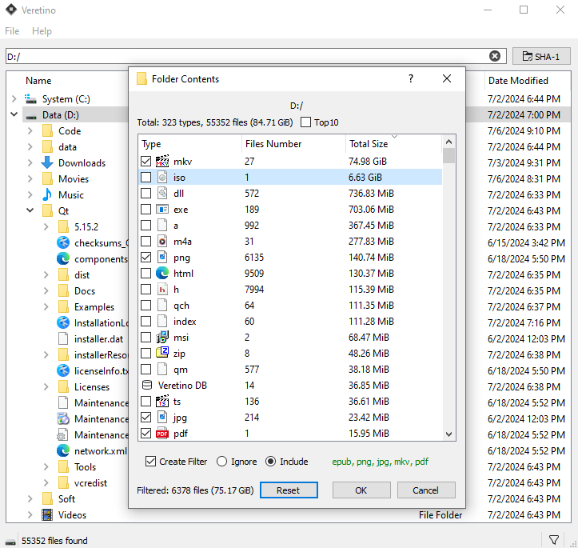
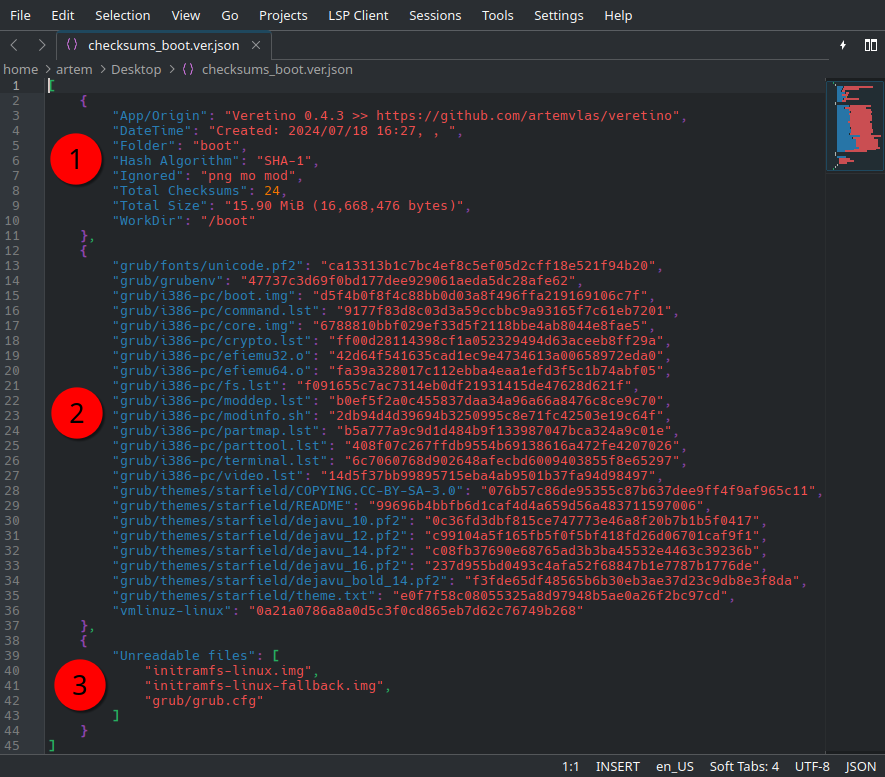

# Veretino: a new way to verify data integrity
_With this application, the integrity of both individual files and entire lists can be verified.
Analyze the contents of folders, calculate checksums, and easily find modified or corrupted data..._

### The app allows you to check the folder-wide data integrity, for example, after numerous transfers and recopies, uploads/downloads from clouds and storages, transfer to other devices, and so on...

#### Key features:
* [x] **Multiple** checksums calculator and organizer.
* [x] Validation of the _copied/moved/long-stored_ **folder**.
* [x] Checking the integrity of file **arrays.**
* [x] Verification of **folder** immutability.
* [x] **Data audit**: analysis of folder contents, looking for folder-wide data changes.
* [x] Finding damaged files in a folder.
* [x] Creation and verification of **Digest** files.
* [x] Comparing files by checksum.

### Veretino can check the integrity of a large amount of data, for example, after a disk or file system error occurs, bad or unreadable sectors appear, a sudden power outage and similar cases...

#### How it works:
* To begin with, the program calculates a list of checksums for all files (or filtered file types) in the specified folder (and its subfolders) and stores it in the local json file (see [Veretino Database format](https://github.com/artemvlas/veretino/wiki/Veretino-Database)).
* Having a ready-made database, the program becomes able to check the integrity of the folder's data by reading its current contents and comparing it with the previously created data set.
* The resulting data also makes it possible to find new or missing items by comparing the current contents with a previously one.

|               |        |
|---------------------------------------------------------|----------------------------------------------|
|  |  |

The program allows analyzing the contents of folders by file types, their number and size. Finding the largest and most numerous file types, which is useful when creating a database with a specific filter.

When working with individual files: the program can operate with checksums (copy, store, check) both from the clipboard and digests (*.sha1/256/512).

The App allows you to avoid unexpected data loss*, for example, in case of a disk error or incomplete download. Checking across the entire folder and multiple subfolders allows you to detect data loss in any of the contained files.

#### *Please note that the Veretino app does not repair the data and is not able to prevent its loss, but only serves to verify its integrity.
---
Veretino App is Qt based and cross platform. Prebuilt packages for Linux and Windows are available [here](https://github.com/artemvlas/veretino/releases)

For users of Arch-based distros: [AUR](https://aur.archlinux.org/packages/veretino)

#### Building the app is very easy:
* Download and extract the source code or type in the terminal:

      git clone https://github.com/artemvlas/veretino
* execute 'makeScripts/makeInstall.sh'
* Or do it yourself:

      mkdir build
      cd build
      qmake ..
      make -j$(nproc)
      sudo make install
