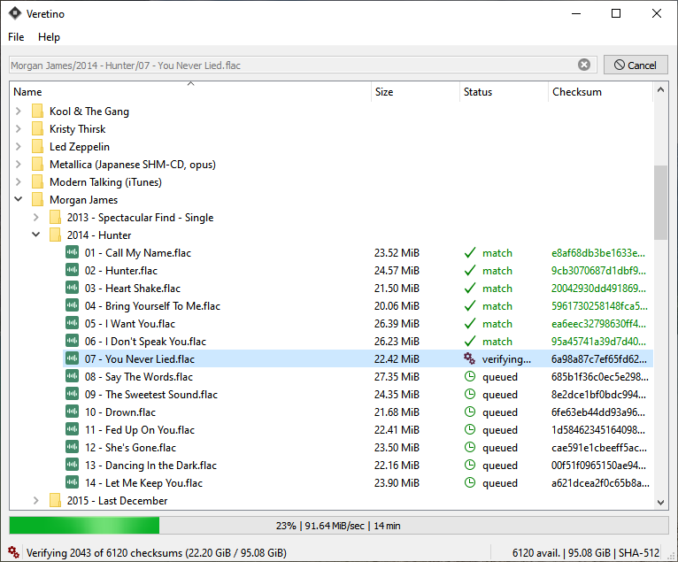

# Veretino
### The app allows to verify folder-wide data integrity, for example, after numerous transfers and recopies, uploads/downloads from clouds and storages, transfer to other devices, and so on...

Veretino creates a local database containing all the paths to the files in the specified folder, as well as their checksums. This database can be used to check the integrity of individual files in the folder, as well as to check the entire folder for data changes.
The App can also determine if there are new or missing files in the given directory relative to the list.
Filters also can be applied to exclude unnecessary files from the list.

The App is Qt based and cross platform.

  

after computing checksums the app creates json database like this:

Some settings available

  

by parsing the database (a regular Json file, by the way), you can check the entire list of files or selected ones for matching SHA checksums, as well as check and update the presence / absence of files on the disk

  

The App allows to avoid unexpected data loss*, for example, in the event of a disk error or incomplete download. Checking across the entire folder and multiple subfolders allows to find data loss in any of the contained files.

#### *Please note that the Veretino app does not repair the data and is not able to prevent their loss, but only serves to verify and inform about integrity
